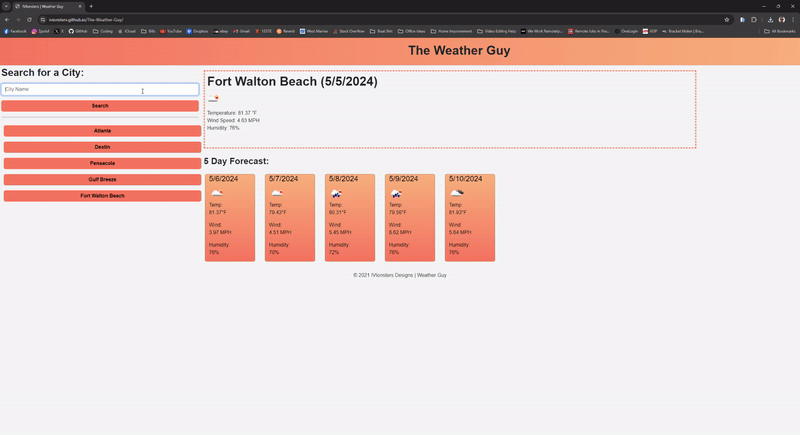
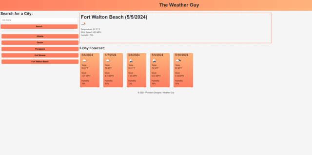

# The-Weather-Guy

## Table of Contents

* [About The Project](#about-the-project)
* [Languages](#languages)
* [Features](#features)
* [Usage](#usage)
* [Credits](#credits)
* [License](#license)  

## About The Project

The Weather Guy is a 5 day forecast weather dashboard, designed to show you the weather in any searchable location worldwide! Previously searched cities will appear to your left. Current city will appear in the center directory! Check <a href="#usage">Usage</a> for more information!   

<a href="#readme-top">back to top</a>

## Languages

- 
- 
- 
- 

<a href="#readme-top">back to top</a>

## Features

* **Recently Search:** Recently searched cities will appear on your left! Simply click to bring up the forecast.
* **Search Function:** Search function , simply type a city, click search and it will recognize any city worldwide! 
* **Alert Errors:**  If you enter a city name incorrectly! Not to worry the application will alert you to reenter.
* **5 Day Forecast:** Application will show you the current day plus the next five days forecast. 
* **Console Log(DEVS ONLY):** Application has sever checks and balances, and logs along the way to determine any errors or bugs that may arise.

<a href="#readme-top">back to top</a>

## Usage

* [The Weather Guy Live](https://ivionsters.github.io/The-Weather-Guy/)

* [Github Repo](https://github.com/IVIonsters/The-Weather-Guy)

* 

* 

<a href="#readme-top">back to top</a>

## Credits

* [N/A](N/A)

<a href="#readme-top">back to top</a>

## License

<a href="#readme-top">back to top</a>
